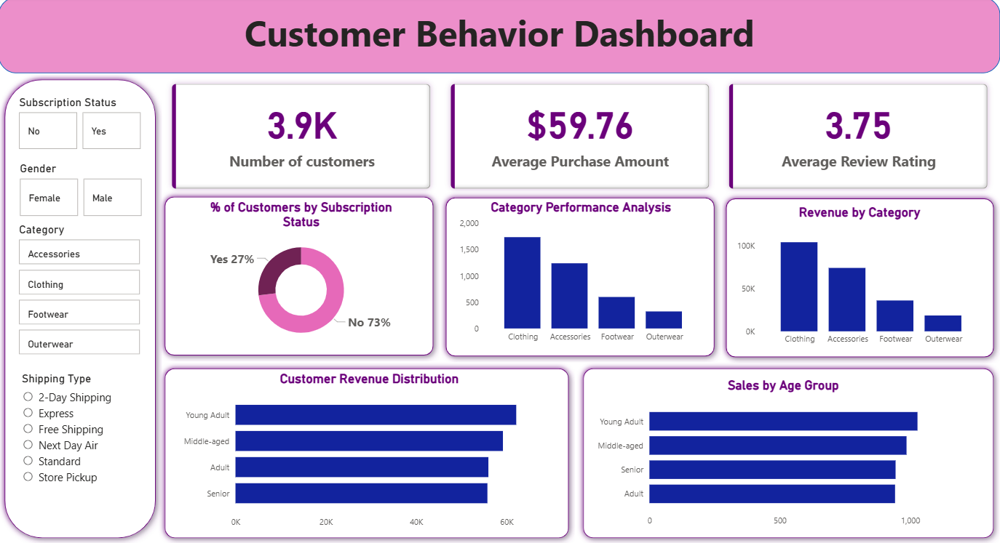

#  Customer Shopping Behavior Analysis

##  Overview
This project focuses on analyzing customer shopping behavior using an end-to-end data analytics workflow. It includes data loading, cleaning, exploratory data analysis (EDA), SQL-based insights, and an interactive Power BI dashboard.

The goal is to uncover patterns in customer spending, product performance, and segmentation to generate actionable business insights.

---

##  Dataset
The dataset contains customer-level transaction data, including:
- Customer demographics (age, gender)
- Purchase details (amount, product, category)
- Subscription status
- Shipping type
- Review ratings
- Purchase history

---

##  Tools & Technologies

- **Python**
  - pandas – Data loading, cleaning, and transformation  
  - numpy – Data operations and logical checks  

- **Database**
  - MySQL – Data storage and SQL analysis  
  - SQLAlchemy – Database connection and data transfer  
  - PyMySQL – MySQL connector  

- **Visualization**
  - Power BI – Dashboard creation and insights  

- **Environment Management**
  - python-dotenv – Secure handling of database credentials
    
- **Development Environment**
  - Jupyter Notebook – Analysis workflow  

---

##  Data Security
- Database credentials were managed securely using environment variables (.env file) to prevent exposure of sensitive information.
  
---

##  Project Workflow

### 1. Data Loading & Exploration
- Loaded dataset using Python
- Performed initial data inspection
- Identified missing values and inconsistencies

### 2. Data Cleaning
- Handled missing values
- Corrected data types
- Standardized categorical values

### 3. Exploratory Data Analysis (EDA)
- Analyzed customer demographics
- Identified purchasing patterns
- Explored relationships between variables

### 4. SQL Analysis (MySQL)
- Revenue analysis by gender and age group  
- Customer segmentation (New, Returning, Loyal)  
- Discount impact on purchases  
- Subscription vs non-subscription behavior  
- Top-performing products and categories  

### 5. Dashboard Creation (Power BI)
- Built an interactive dashboard to visualize:
  - Total customers, average order value, ratings
  - Revenue by category and age group
  - Subscription distribution
  - Category performance

---

##  Dashboard
The Power BI dashboard provides a visual summary of key insights:
- Customer distribution and segmentation
- Revenue trends across categories
- Purchase behavior by age group
- Subscription impact analysis

---

##  Key Results & Insights
- Male customers contribute significantly higher revenue  
- Majority of customers are loyal, indicating strong retention  
- Subscription model does not significantly impact spending behavior  
- Some products are highly dependent on discounts  
- Revenue is evenly distributed across age groups  
- No single product dominates—multiple items perform consistently well  

---

##  How to Run

### 1. Python (EDA)
- Open the Jupyter Notebook
- Run all cells to perform data cleaning and analysis

### 2. MySQL (SQL Analysis)
- Import dataset into MySQL
- Run the SQL script:

### 3. Power BI
- Open the `.pbix` file
- Interact with the dashboard and filters

---

##  Acknowledgement
This project was inspired by a YouTube tutorial originally implemented using PostgreSQL.  
This version recreates the same analysis using **MySQL**, along with additional insights and enhancements.

---

##  Contact
Feel free to connect or provide feedback!
